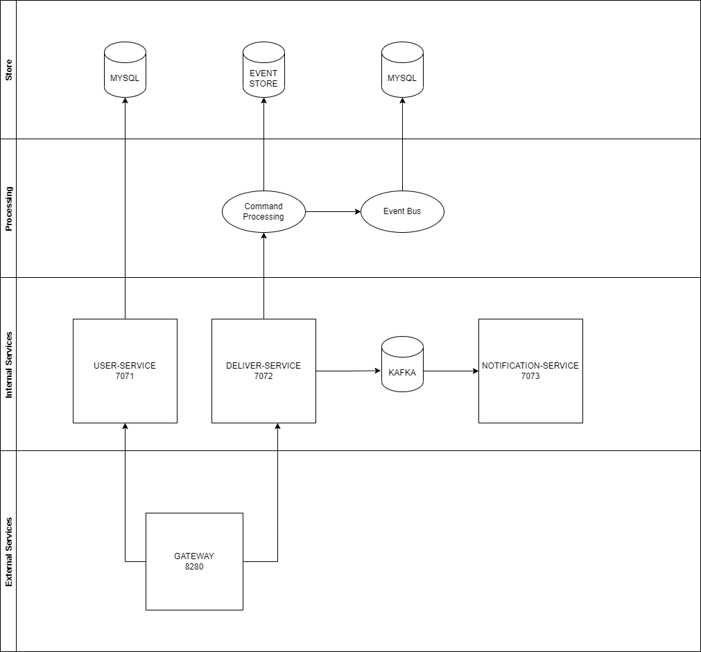
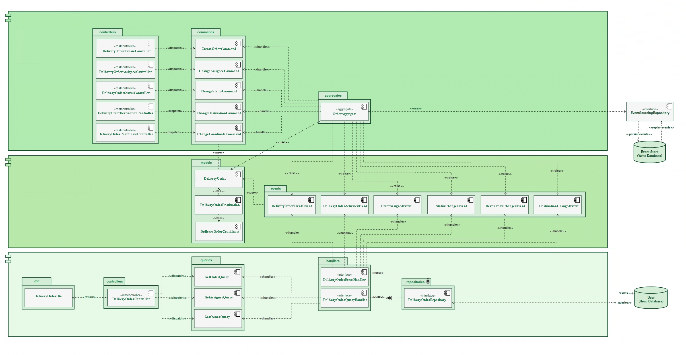

# Spring Boot Axon Parcel Delivery Application

## Introduction

This is a sample application to demonstrate Spring Boot (2.5.2) and Axon Framework (4.0.3).

The Todo application makes use of the following design patterns:
- Domain Driven Design
- CQRS
- Event Sourcing

## Building
> mvn package

## Running
> docker-compose up

## Api call
http://localhost:7007/user/swagger-ui.html  
http://localhost:7007/deliver/swagger-ui.html

## Implementation

Implementation notes:
- The event store is backed by a JPA Event Store implementation which comes with Axon
- The query model is backed by a Spring Data JPA Repository

## Documentation

* Axon Framework - http://www.axonframework.org/
* Spring Boot - http://projects.spring.io/spring-boot/
* Spring Framework - http://projects.spring.io/spring-framework/
* Spring Data JPA - https://projects.spring.io/spring-data-jpa/

## Acceptance Criteria
* GIVEN order and customer 
  WHEN order is created  
  THAN status is CREATED
* GIVEN order 
  WHEN status is CREATED  
  THAN automatically change status to PENDING
* GIVEN order and admin 
  WHEN status is PENDING  
  THAN can assignee delivery to courier 
* GIVEN order and courier 
  WHEN status is PENDING  
  THAN admin can change status to PICKUP 
* GIVEN order and courier 
  WHEN status is PICKUP  
  THAN admin can change status to DELIVERY 
* GIVEN order and courier 
  WHEN status is DELIVERY  
  THAN admin can change status to DELIVERED 
* GIVEN order 
  WHEN stautus is DELIVERED  
  THAN can not change of status 
* GIVEN order and customer 
  WHEN stautus is  DELIVERED  
  THAN can not change of status to CANCEL   

## Architectthure of Project
There has 3 domains 
* User Service
* Delivery Service 
  There are 5 statuses for deliver 
    * CREATED 
    * PENDING
    * PICKUP
    * DELIVERY
    * DELIVERED
    * CANCELED
* Notification Service

User Service is simple CRUD application
Delivery service are Event Sourcing and CQRS implementation  
Notification Service is send sms to customers

## Architectthure of Delivery Service

## It is possible in my side
* Add Customer payment and implement Saga design pattern
* Add kubernate deployment in a google cloud (see deploy folder)
* Connect Event Source to Cassandra or MongoDb
* For manage delivery status it is easily implement Cammmunda or another BPMN
