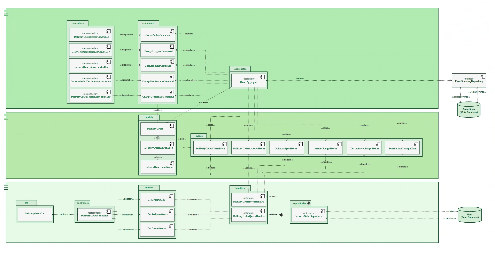

# Spring Boot Axon Parcel Delivery Application

## Introduction

This is a sample application to demonstrate Spring Boot (2.5.2) and Axon Framework (4.0.3).

The Todo application makes use of the following design patterns:
- Domain Driven Design
- CQRS
- Event Sourcing

## Building
> mvn package

## Running
> docker-compose up

## Api call
http://localhost:7071/security/swagger-ui.html  
http://localhost:7072/deliver/swagger-ui.html

## Implementation

Implementation notes:
- The event store is backed by a JPA Event Store implementation which comes with Axon
- The query model is backed by a Spring Data JPA Repository

## Documentation

* Axon Framework - http://www.axonframework.org/
* Spring Boot - http://projects.spring.io/spring-boot/
* Spring Framework - http://projects.spring.io/spring-framework/
* Spring Data JPA - https://projects.spring.io/spring-data-jpa/

## Architectthure of Delivery Service

